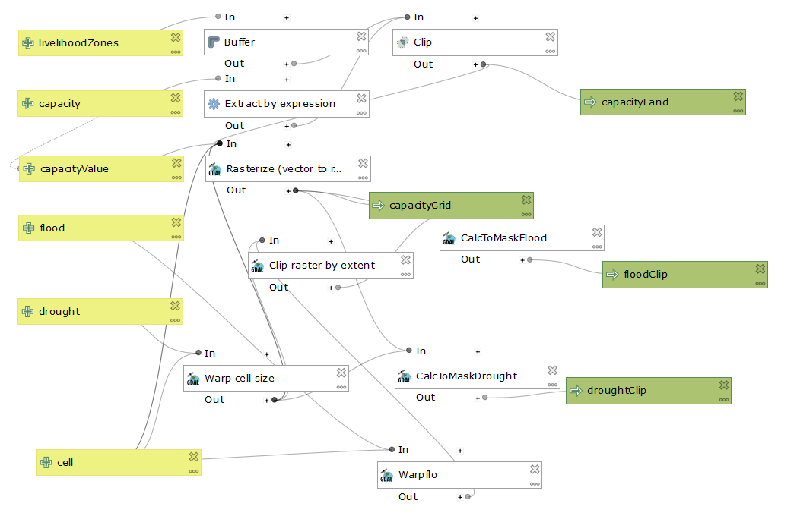

# Reproducibility in Geographic Research
## Malcomb et al, (2014): Vulnerability modeling for sub-Saharan Africa: An operationalized approach in Malawi

The focus of this lab was to investigate reproducibility and replicability in geographic research. We looked specifically at one article that was attempting to quantify social vulnerbality in Malawi. We started off by looking for Malcomb's data, and found some of it, but not all of it. Malcomb used data from the Department of Health Surveys, UNEP GLobal Risk, and FEWSNet. Our professor was able to acquire the DHS data, but it you do need to apply to use it. The UNEP data is availible to anyone online, but Malcomb was not clear about which data sources he used, so we had to take an educated guess, and we were unable to find the FEWSNet data.

The DHS surveys were conducted between 2004 and 2010, and we have access to the same DHS surveys that Malcomb et al used. The FEWSNET data they used was from 2005. The data Malcomb pulled from the UNEP Global Risk Platform about drought was from 2009, whereas the data we used was updated in 2014 (according to the metadata on the [data page of the UNEP GLobal Risk Platform](https://preview.grid.unep.ch/index.php?preview=data&lang=eng). We used the flood risk layer from UNEP, which was last updated in 2014, however, based on the fact that Malcomb said his flood data was from Dartmouth and covered 1999-2007, he almost certainly used the events raster on the UNEP flood page, despite saying that he uses data about physical exposure and risk at different points in the paper, which are both also layers under the _flood_ category on the UNEP page.

We uploaded this data into PostGIS using [this R script](rtransscript.r)

Due to legal restrictions on the data, we the students we unable to look at the data, but we looked at the metadata, and from that we were able to develop an SQL script that isolated the data we wanted. We then put it into quantiles (with our best guess as to how Malcomb did it), and attached the survey points to the traditional authorities that Malcomb used in his analysis. We used the EPSG:4326 projection, but don't know for sure what projection was used in the paper.

The adaptive capacity scores in the traditional authorities produced the map below

The SQL queries we used are [included here](vulnerabilitySQL.sql)

Using the hierarchical chart showing the weights given to each factor, we attempted to recreate the map of vulnerability that Malcomb et al created. The flood risk and drought risk layers were in different pixel sizes, so we made the map in both, although we can tell that the authors used the smaller size, which was 0.416667. We used [a model in QGIS](finalmalawimodel.model3) that approximates the steps we guessed that Malcomb et al took in creating their map. The layout of the model is pictured below.

The model does not actually create the final map, but instead creates individual raster for flood scores, drought scores, and adaptive capacity scores. At this point the flood data and the DHS data are in quintiles, but the drought data is not. We used the _generate recode rules_ option in the GRASS r.Quantile tool to create [a reclassification table](report_rd2.txt) for turning the drought raster into a 1-5 scale, and then convert that html file in a txt file. We then used that txt file in the GRASS r.Recode tool to recode the drought layer to be on a 1-5 scale.

Using a raster calculator function, I multiplied the modified drought raster by 0.2 because it 20% of the score for Malcomb et al and I multiplied the flood raster by 0.2 after adding 1 to it because the flood scores were from 0-4, while capacity and drought were 1-5, and drought is also woth 20% of the score. For the adaptive capacity scores, I multiplied the scores by 0.4 because they are 40% of the analysis, and then I subtracted the scores from 2 because we had the scores set up where 1 was high and 5 was low, so I needed to invert that. I subtracted them from 2 and not from 5 because I had already multiplied by 0.4. 

We pulled the UNEP rasters in PostGIS using [this batch script](convertRaster.bat).

Here is the map at the larger resolution

Here is the map at the smaller resolution, the one used by Malcomb et al

For comparison, the map that Malcomb et al produced

Neither map looks exactly like the map in the original paper, but they are relatively similar in terms of the results output, and it is impossible to know whether differences are due to us not following the same steps Malcomb et al followed, or due to us not being able to access all the same data that Malcomb accessed.

Both reproducibility and replicability are poor in the article. Without the data included, its hard to access it all, such as the mysterious FEWSNet data (although Malcomb can't be blamed for the fact that the DHS data needs to be applied for). But beyond that, the author's are not specific about what data they use from those DHS surveys and from UNEP, so we had to guess. Pieces of what they did are replicable, but without specific GIS methods and tools its impossible to know whether we are doing exactly what they did, and it also requires the data they used being availible in all countries.

The authors are also just not very clear about what their methodology was. In addition the issue with the flood dataset that I mentioned earlier, they also write that they scale everything into quintiles, on a 0 to 5 scale, which is confusing because quintile implies there five different groupings, but a 0 to 5 scale has six different groupings. 

Another issue with the data is the uncertainity, as the authors attach the dhs survey points to traditional authorities, but those surveys are intentionally placed within a random buffer area (5km for rural points and 2 km for urban) to protect personal data, and although they are kept within their district, traditional authorities are smaller than districts and so survey points could be attributed to traditional authorities which they are not actually in.

One of the most important things we can do as geographers is to include the data we used, or specific instructions on how to access that data, in our reports. It is also important to include what was done in GIS to turn the data into our result. That should mean detailed descriptions of what was done and maybe a workflow, and also attaching a model if one was used in the analysis.

Malcom uses what Tate (2012) calls a hierarchichal approach. This because it is based on a hypothesis, making it deductive, and also creates a structure of how the variables are organized, with several variables underneath three broader categories. Although Malcomb doesn't base his research off of a singular theory, he seems to be taking previous research into account, and also uses local knowledge, albeit in limited ways, to guide his research. This is in contrast to what Hinkel calls "non-substantial" vulnerability research, wherein researchers use only the relation between variables to determine vulnerability, and don't actually think about what causes vulnerability, which makes this research not particulary meaningful (Hinkel 2011). Malcomb does not account for uncertainty in his data, which is a problem because the survey data has a lot of uncetainty due it being a sample. A Monte Carlo simulation is a good way to account for uncertainty, especially in a vulnerability analysis because there is no way to actually measure vulnerability (Tate 2012).

Another problem is that the way vulnerability was measured here is flawed. We have no idea how accurate the DHS survey's are, and its very posible people simply lied on them, especially given that there is a history of mistrust between locals and aid organizations. In fact, using the data sources Malcomb et al used might not be accurately measuring vulnerability. The author's only included local knowledge in deciding which DHS survey factors were the most important, so there might be other, very important factors that contribute to vulnerability that are not included here. Malcomb et al also gave each factor its own weighting, and what is essentially their best guess at how important each DHS survey category is could be completely wrong. At a deeper level, there is the issue that Hinkel (2011) brings up, which is that there is no clear definition of what constitutes vulnerability, as it a concept created by researchers. Hinkel attempts to create his answer to what is vulnerability, but really it is entirely subjective based on the ideas of the researchers, even if it is driven by previous investigations and theory.

-----------------------------------------------------------------------------------------------------------------------------

Malcomb, D. W., Weaver, E. A., & Krakowka, A. R. (2014). Vulnerability modeling for sub-Saharan Africa: An operationalized approach in Malawi. Applied Geography, 48, 17–30. https://doi.org/10.1016/j.apgeog.2014.01.004

Tate, E. (2012). Social vulnerability indices: A comparative assessment using uncertainty and sensitivity analysis. Natural Hazards, 63(2), 325–347. https://doi.org/10.1007/s11069-012-0152-2

Hinkel, J. (2011). “Indicators of vulnerability and adaptive capacity”: Towards a clarification of the science–policy interface. Global Environmental Change, 21(1), 198–208. https://doi.org/10.1016/j.gloenvcha.2010.08.002

