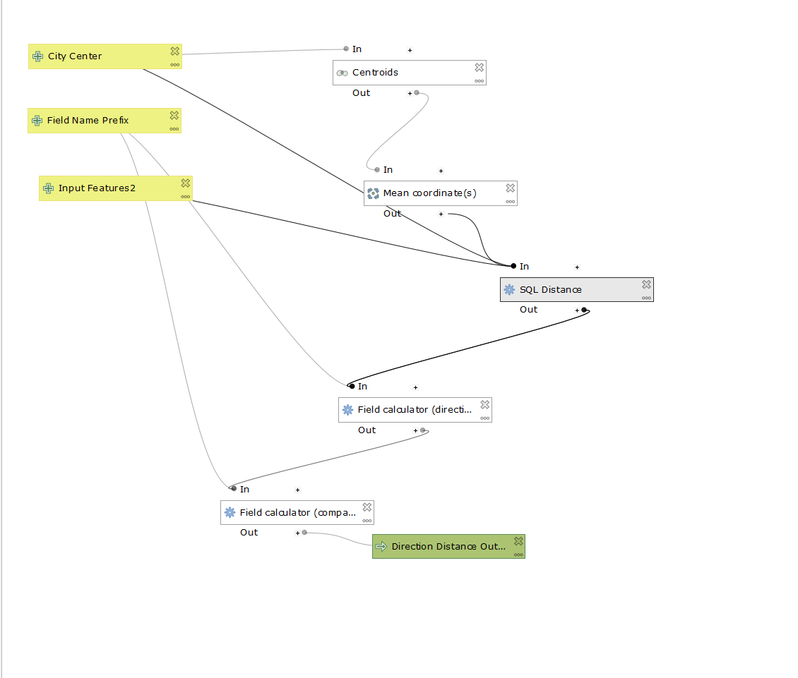
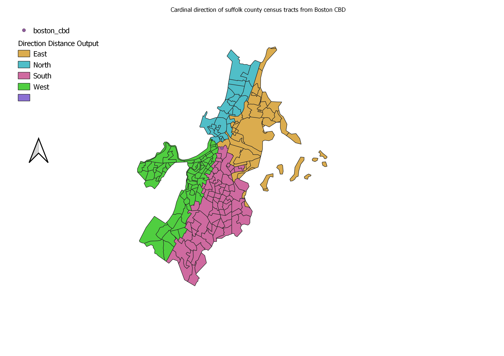
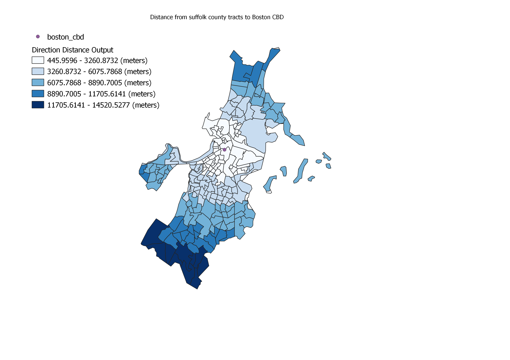

## My first QGIS model

I made this model for finding direction and distance in my QGIS class

[my first QGIS model](model1_v3.2.model3)

[Here](model1_v3.2.model3) is an updated version of the model that that uses an SQL transform function for geodesic measurements which are more accurate

I used the updated model to calculate the direction and distance of the census tracts in Suffolk County, MA from the Central Business District of Boston, and showed how distance comparess to median gross rent in [this scatter plot](boston_scatterplot.html), as well as how direction compared to median gross rent in [this polar plot](polar_boston.html)

The data is stored in [this geopackage](Suffolk_tracts.gpkg), which includes the point I used for the raw data for the latinx population and Median Gross Rent in Massachusets, as well as the CBD I generated and a shapefile of the census tracts in Suffolk county with the relevant data joined.

This new model compensates for differences in projections by reprojecting all inputs in wgs 1984, where distance is always accurate, through an sql query and calculating this distance between the cbd and other points after this. 

The model can be seen here:

Here is a map of the directions it calculated for each census tract from the CBD of Boston

Here is a map of the distances for each census tract from the CBD of Boston

This model was full of issues, and it took lots of work to make, and still doesn’t function 100% as desired (the city center input must be a point, it cannot be a shapefile). My professor was able to file a bug notice on a forum, and soon after received a response from one of the lead developers of QGIS, which really emphasized to me how adaptable and user-centric open source can be (even though, in this case, the developer stated that it was actually working as designed). This would have never happened in a course taught using ArcGIS, and emphasizes why not teaching heterodox GIS is important, which is one of the main points in Kevin St. Martin and John Wing’s article “The Discourse and Discipline of GIS” (2007). Seeing this in action also very much rejects the idea that GIS is progressing on a linear path, as it is rejected in St. Martin and Wing (2007). What makes sense to my professor is not what seems logical to the developer. There is no one way forward, there are many possibilities of what GIS can become. 

I feel that this lab represents how GIS and geography don’t need to be separate. Although the results are very qualitative, the question of how median gross rents vary in relation to a central business district is rooted in the theoretical framework of geography, where Hoyt’s sector theory predicts that land use will vary based on direction and distance from a central business district. This ties into the idea from R.E. Sieber’s article “rewiring for a GIS/2” (2004) that GIS is both a technology and a process and should be viewed as both. On one hand, GIS is the tool that allowed me to do this research, but on the other hand, GIS is built with a specific purpose in mind and our values influence how GIS will change. Do we value complexity or ease of use? Data accessibility or paywalls? Especially when considering how GIS is not progressing on a linear, uniformly advancing path, we must be conscious of what we are valuing as we develop GIS.

Some criticism of GIS focuses on GIS as an extension of oppressive institutionalized structures, which pushed GIS into a box that it should not be placed into (St. Martin and Wing, 2007). GIS is a tool that can be used for both good and bad purposes. ESRI may have a market monopoly, but ESRI isn’t GIS, no matter what they try to market themselves as. Opensource GIS allows it to be used by anyone, for any purpose. GIS may be based around western understandings of the world, but researcher’s such as Peter Bol have taken advantage of how GIS does not have a single path forward to create new versions that factor in other ways of thinking, such as how the ancient Chinese represented places as hierarchies, not as locations (St. Martin and Wing, 2007). Ultimately, GIS is more than a quantitative tool, but being a quantitative tool is still its primary function. St Martin and Wing (2007) suggest that GIS is a set of practices and understandings rather than a technology, and while I believe that they are on the right path, I think that viewing GIS as a singular entity is a mistake. GIS is used in such wide-ranging ways that it is better to look at it as multiple discourses centered around the same technology. 
