## Using SAGA for modeling Channel Flow

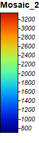

I made this map in SAGA using two SRTM rasters and mosaicking them together. Its a basic DEM that shows the elevation of Mount Kilimanjaro.

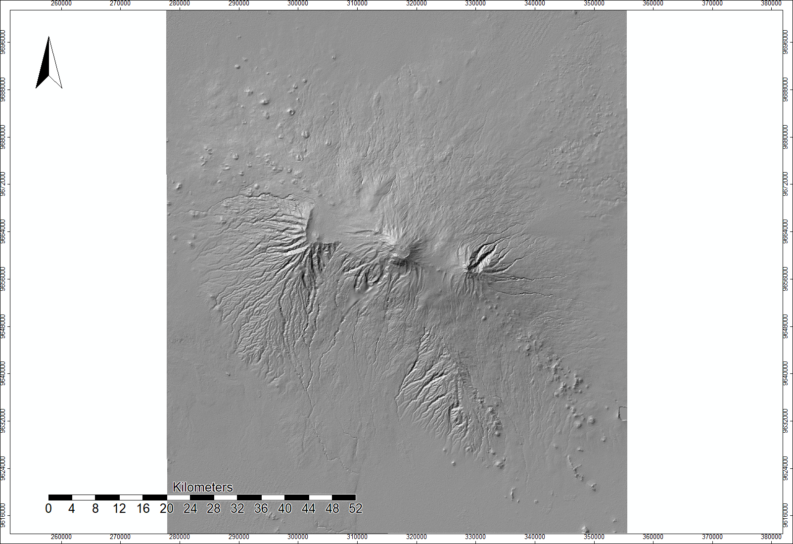
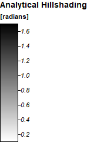

This second map is a hillshade model based on the DEM above. The azimuth is 315 degrees and the altitude is 45 degrees. I produced it using the analytical hillshading tool in SAGA.

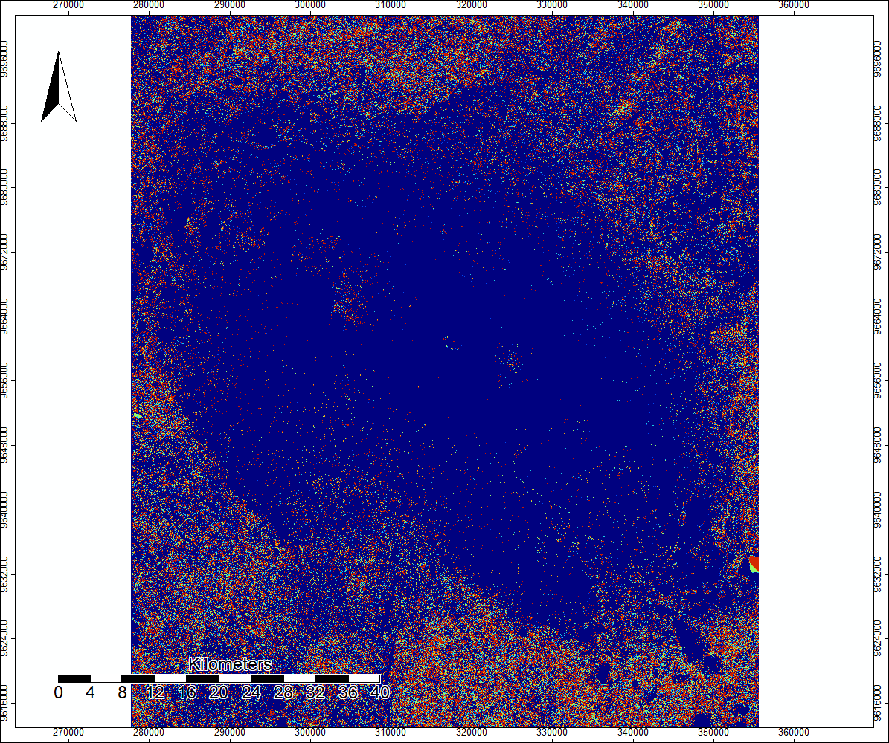
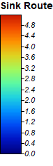

This map shows the sinks in the DEM image, which are spots where one pixel is lower than the surrounding pixels

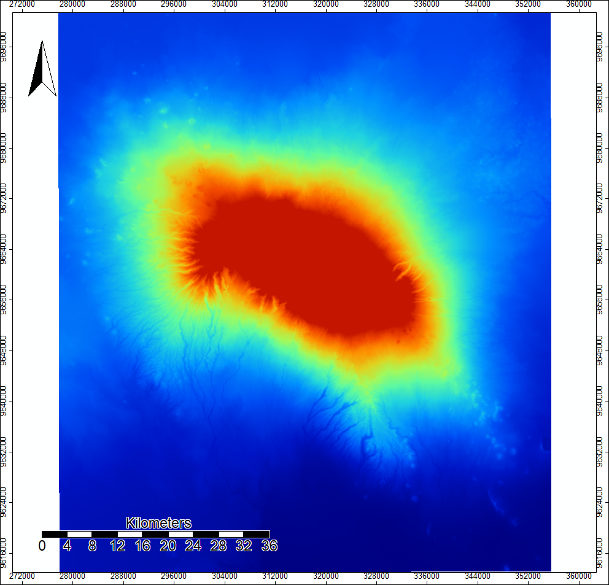
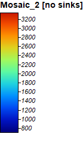

This is a new DEM built from the original Mosaicked DEM and the sink routes image. Although it looks basically identical to the original DEM, it has filled the sinks revealed in the sink routes so that they do not interfere with channel identification.

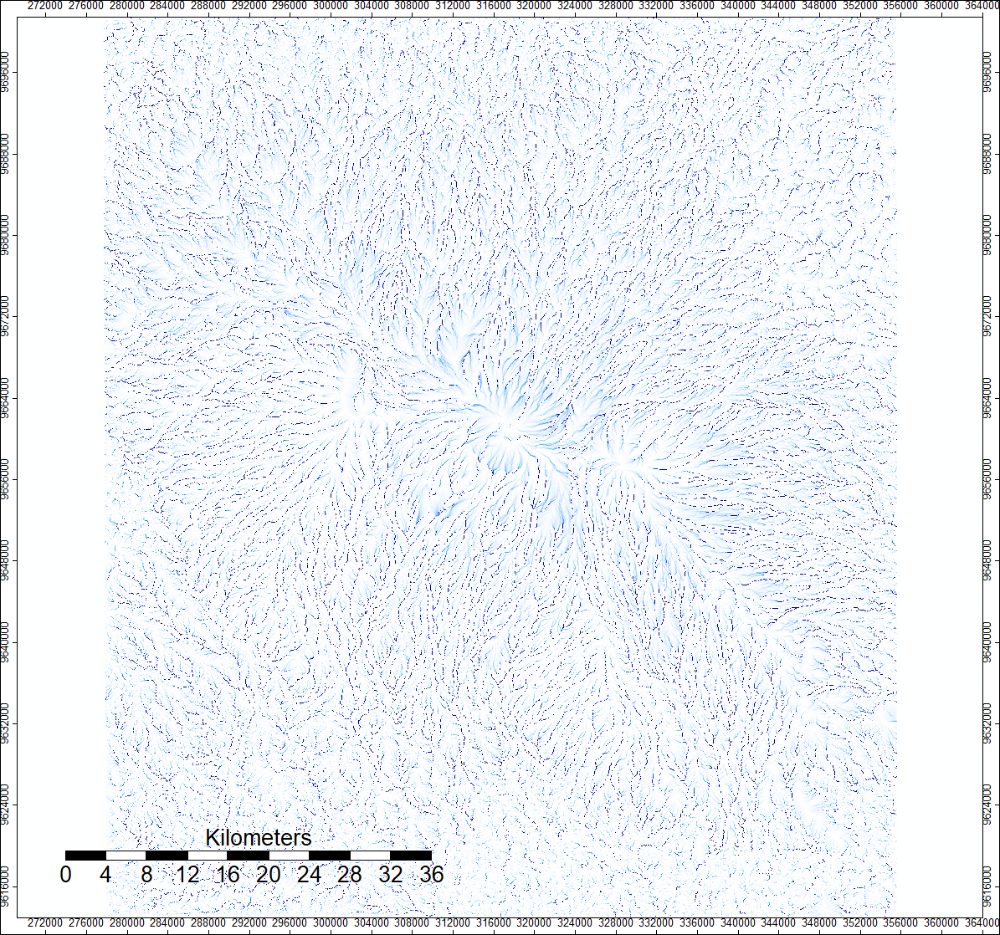
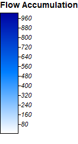

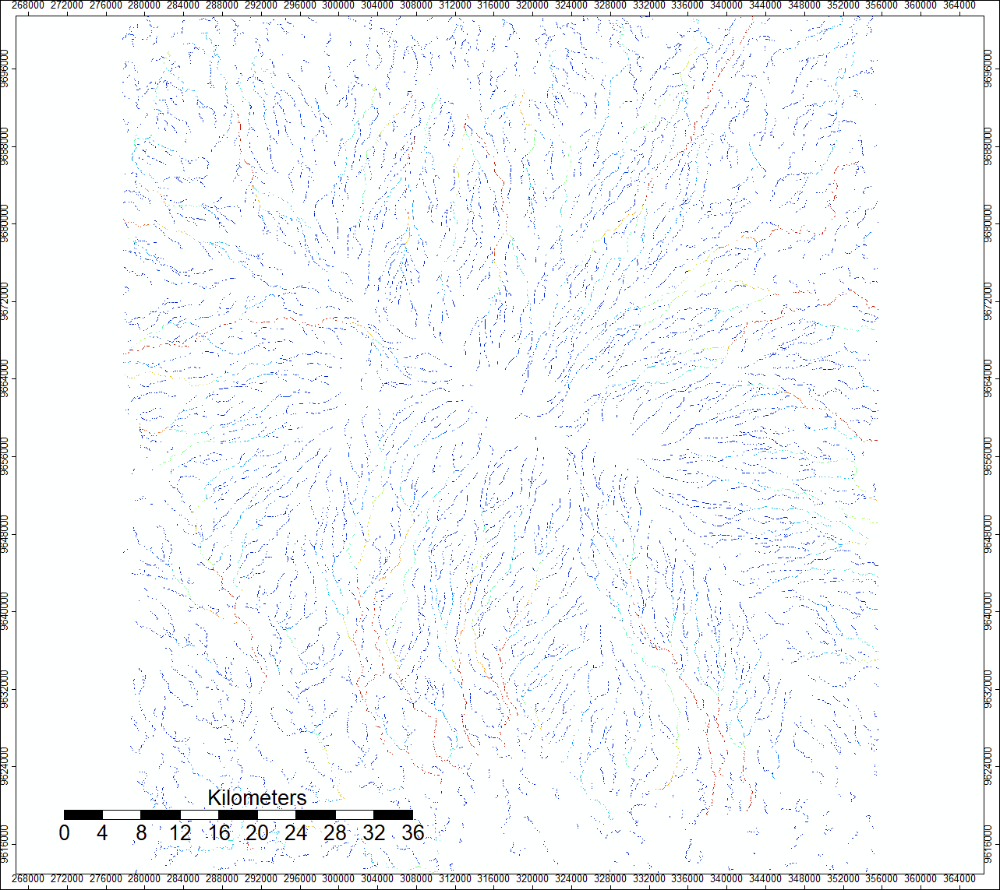
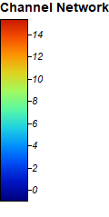

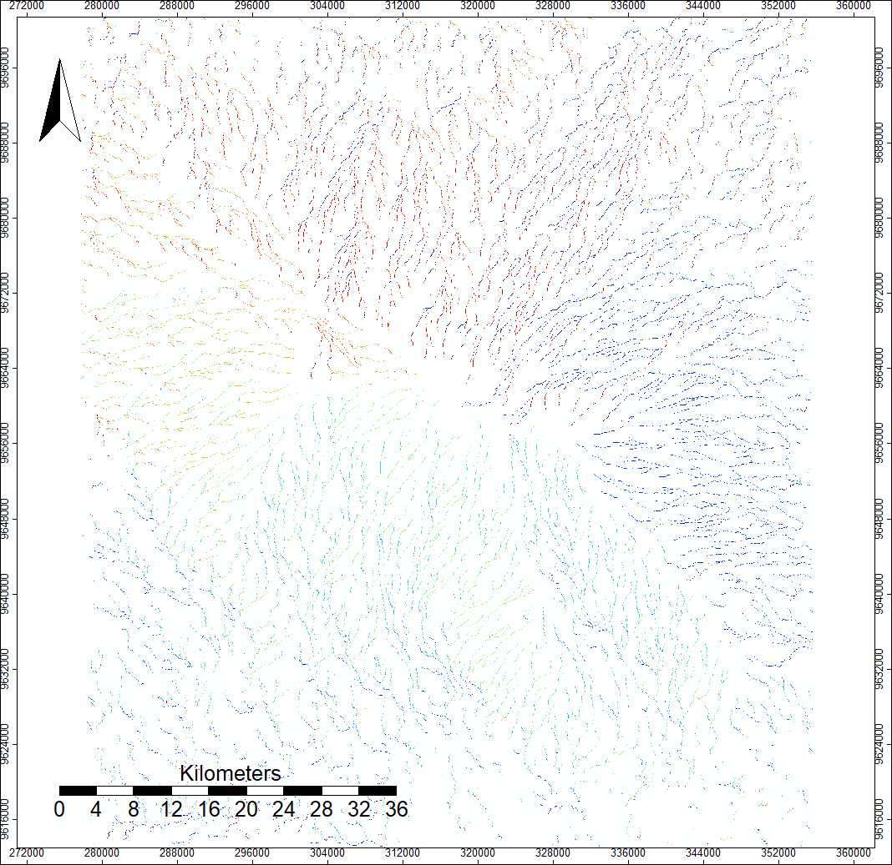
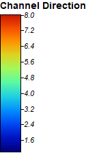

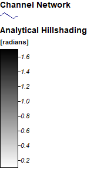
