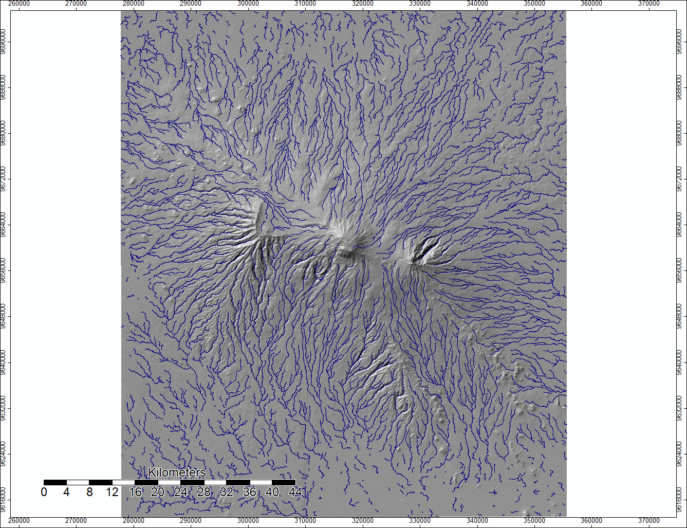

## Using SAGA for modeling Channel Flow

I used SAGA for the first time, and using its tools, modeled where stream channels are likely to form on Mount Kilimanjaro. I started with DEM data from SRTM, acquired through NASA's Earthdata program.

I made this map in SAGA using two SRTM rasters and mosaicking them together. Its a basic DEM that shows the elevation of Mount Kilimanjaro.

This second map is a hillshade model based on the DEM above. The azimuth is 315 degrees and the altitude is 45 degrees. I produced it using the analytical hillshading tool in SAGA.

This map shows the sinks in the DEM image, and the colors indicate the different direction that water will flow in when it encounters these sinks.

This is a new DEM built from the original Mosaicked DEM and the sink routes image. Although it looks basically identical to the original DEM, it has filled the sinks so that they do not interfere with the channel mapping that I plan on using the raster for.

This is a map of top-down flow accumulation, which models where water would flow if water came down from above the DEM (such as rain). The opacity of the pixels indicates how many other pixels would be expected to flow into that pixel.

This map displays the river channels that would be expected to form in the area based on our flow accumulation raster. For the purposes of this map, we set channels to form where the water flow from over 1,000 cells was accumulating. The green and red channels indicate more cells flowing into those channels.

This map has the same pixels filled in as the previous map, but rather than color indicating rate of flow, color here indicates the direction in which the river is flowing.

This map displays a vector version of the channel network overlaid on top of a hillshade, so that how the river channels fit into the terrain can be see. Unlike the raster channel network, the vector version cannot display the rate of flow in any of the channels.

## Using Batch Processes to automate the analysis

I learned to speed up the SAGA analysis by using a batch process, for which I used a .bat file with code designed to run on the windows shell. Using information availible in SAGA on how to use command lines, I was able to code then run a batch process that did the entire hydrological analysis in the windows shell without opening up SAGA at all. I was able to produce identical outputs, and it was also extremely easy to adapt the batch process to run using ASTER data instead of SRTM data, which made doing a comparison of the two datasets much easier. 

Click here for the [ASTER Model](hydro_modelASTER.bat) and the [SRTM model](hydro_model.bat)

Using the batch processes, I was able to make this set of DEM and Channel Network from SRTM data, which are identical to the ones I made in the previous lab

 

And here are the DEM and Channel Networks produced using the same process but ASTER data

 

Another important piece of data I worked with these week was the .num files associated with both SRTM and ASTER. These metadata files contain rasters that tell the user the source of each pixel in the dataset, as not all of it comes from the actual data gathering mission. The .num files are often an indicator of where error might be, and can inform the user as to why that error is there. To visualize this data, I made maps of the .num files to visualize which data sources make up the rasters that I have been using to do my hydrological modeling.

This is the SRTM .num map
 

This work was all done with SAGA 6.2
