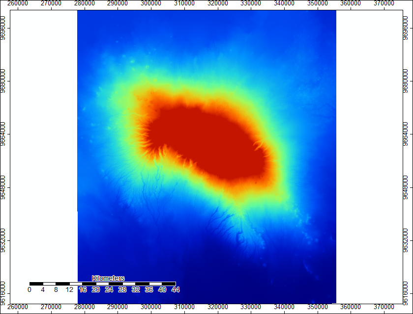

## Using SAGA for modeling Channel Flow

I used SAGA for the first time, and using its tools, modeled where stream channels are likely to form on Mount Kilimanjaro. I started with DEM data from SRTM, acquired through NASA's Earthdata program.

I made this map in SAGA using two SRTM rasters and mosaicking them together. Its a basic DEM that shows the elevation of Mount Kilimanjaro.

This second map is a hillshade model based on the DEM above. The azimuth is 315 degrees and the altitude is 45 degrees. I produced it using the analytical hillshading tool in SAGA.

This map shows the sinks in the DEM image, and the colors indicate the different direction that water will flow in when it encounters these sinks.

This is a new DEM built from the original Mosaicked DEM and the sink routes image. Although it looks basically identical to the original DEM, it has filled the sinks so that they do not interfere with the channel mapping that I plan on using the raster for.

This is a map of top-down flow accumulation, which models where water would flow if water came down from above the DEM (such as rain). The opacity of the pixels indicates how many other pixels would be expected to flow into that pixel.

This map displays the river channels that would be expected to form in the area based on our flow accumulation raster. For the purposes of this map, we set channels to form where the water flow from over 1,000 cells was accumulating. The green and red channels indicate more cells flowing into those channels.

This map has the same pixels filled in as the previous map, but rather than color indicating rate of flow, color here indicates the direction in which the river is flowing.

This map displays a vector version of the channel network overlaid on top of a hillshade, so that how the river channels fit into the terrain can be see. Unlike the raster channel network, the vector version cannot display the rate of flow in any of the channels.

