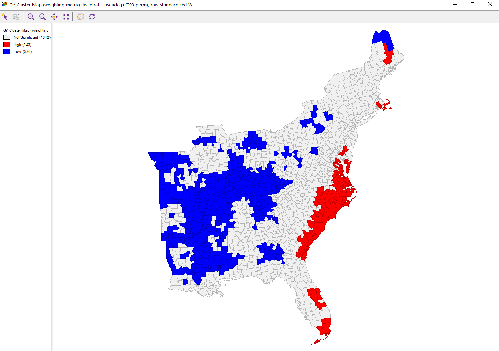

# Using Twitter Data for Research

## A Case Study looking at Hurricane Dorian, attempting to distinguish whether the storm itself or Trump's sharpie drawing generated more interest by looking at where people were tweeting about Dorian

This lab was based on gathering spatial twitter data through the Twitter API, using the R library rtweet. The data gathered was any tweet with the keyword "Dorian" Spatial twitter data comes in many forms; some data has specific coordinates, but the majority of twitter data that has some sort of spatial element is attributed to the bounding box of whatever spatial element that is, whether a city, a landmark, a state, or even an entire country. For this reason, we had to find the centroids of the bounding boxes, and then convert the datapoints to be geographically located in the center of those bounding boxes. We did not include large areas such as states or the whole United States in our analysis. That was for the spatial part of the analysis, which was done in PostGIS, QGIS, and GeoDa, but first we did some non-spatial analysis in R, using [this script](dorian.r) to look at the most common keywords in the tweets about Hurricane Dorian, as well as how these words were associated. The same R script was used to upload data in PostGIS and to take census data using the API

This is a chart of the most common words in tweets about Hurricane Dorian, and while the prescence of "dorian" and "hurricane" is not particularly interesting, its very notable that 4 of the following 5 top keywords are about Trump's map alteration, rather than about the hurricane itself. Despite the fact that Dorian dealt historic damage to the Bahamas, with a death count in the hundreds if not thousands, the president's alteration of a NOAA map to include Alabama in Dorian's path was tweeted about more than the Bahamas were.

This is a word association map, showing all words that were included in over 30 tweets about dorian, and the closer they are to another word, the more they were used together in the same tweet. Its interesting that Fake News and most of the Trump-related words are not close together. In general, we see the trump related tweets concentrated in the left and center-left, while words about the actual hurricane spread out from around those tweets, showing that the sharpiegate related tweets were more likely to include the same keywords as other sharpiegate related tweets, while tweets about Dorian the hurricane were less likely to use th

Going back to the spatial data, I took the tweets and put them into my PostGIS database, then analyzed them using [this sql code](noteslab10.sql). The general idea was to create two new columns, one called tweetrate, which normalized the number of tweets by the population in the county the tweet was from, and another called normalized differential tweet index, which normalized the number of tweets by the number of tweets over the same period of time in November. 

Using this data, I created a heatmap showing which areas had the highest tweet rates about Dorian. The heatmap was made in QGIS using the Heatmap (Kernel Density Estimation) tool with a radius of 100 kilometers, weight from field as the tweet rate column, and a pixel size of 500 meters.

The heatmap shows that the most tweets were along the east coast, areas that may have been hit by Dorian.

I also performed a Getis-Ord G* analysis of the tweet rate data in GeoDa (using [this threshold distance weighting matrix](weighting_matrix.gwt). That created the map of concentrated heighs and lows by county seen below (at a 0.05 signifigance level), as well as a map of the statistical signifigance of the difference.

These results are interesting in that you can see Sharpiegate generated a lot of interest on twitter. Tweets about Trump's map alterations clearly outpaced tweets about the disaster in the Bahamas, although we see that the tweet rate had hotspots along the southern Atlantic coast, indicating that a lot of people tweeting about the storm who those were more likely to be affected by it. This excercise is also interesting because it shows the power of what Elwood et al (2012) call _volunteered geographic information (VGI)_. Essentially, the internet is a treasure trove of information, and when properly accessed and used, can open up new avenues for research. Without twitter (or other social media platforms), determing whether people across the country cared more about a hurricane or something the president said about a hurricane would have required extensive surverying, and now I can do it in an hour with a twitter API. VGI is essentially a constantly updating dataset that can cover any range of topics. While it has great oppurtunities, it also brings new problems. Its nearly impossible to confirm the quality of the data, and it comes in an extremely messy form. Biases, while always a problem in data, are much harder to point in such unorganized data than they are in a more standardized dataset, like a survey or the census. Elwood et al also raise ethical issues, such as the ethics surrounding personal information being shared on the internet by a seperate person or group, as well as when research could lead to legal liability.

In the interest of reproducibility, [click here for the tweet ID's for rehydration](dorianTweetIDs.csv)

-----------------------------------------------------------------------------------------------------------------------------

Elwood, S., Goodchild, M. F., & Sui, D. Z. (2012). Researching Volunteered Geographic Information: Spatial Data, Geographic Research, and New Social Practice. Annals of the Association of American Geographers, 102(3), 571–590. https://doi.org/10.1080/00045608.2011.595657

Wang, Z., Ye, X., & Tsou, M.-H. (2016). Spatial, temporal, and content analysis of Twitter for wildfire hazards. Natural Hazards, 83(1), 523–540. https://doi.org/10.1007/s11069-016-2329-6
