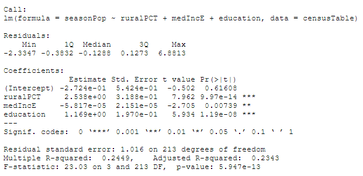
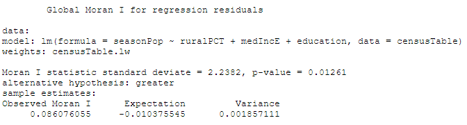
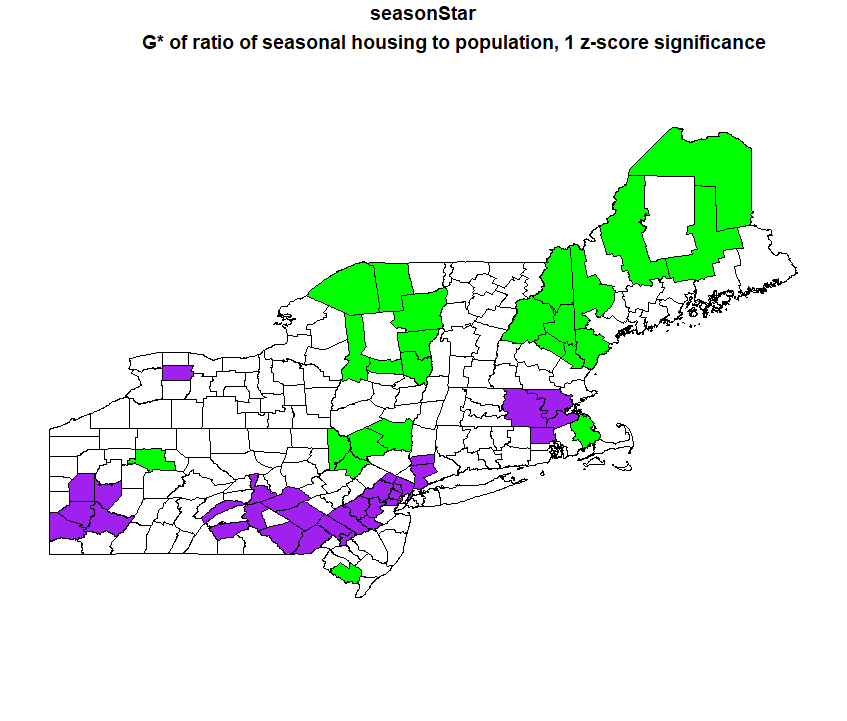
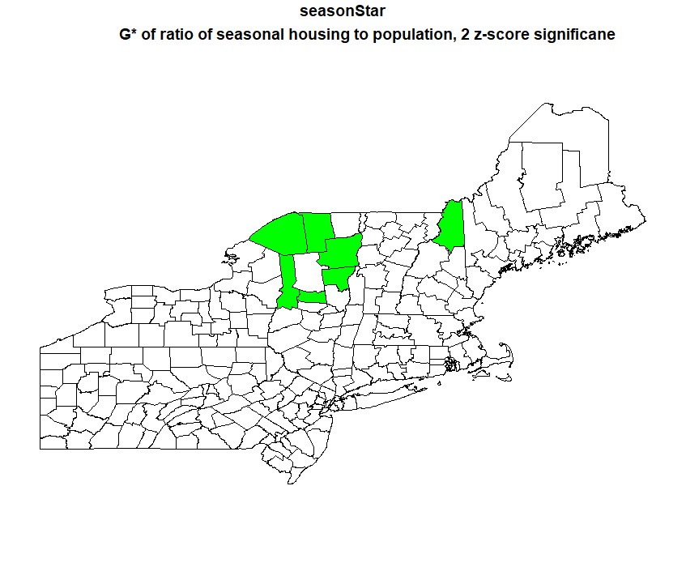
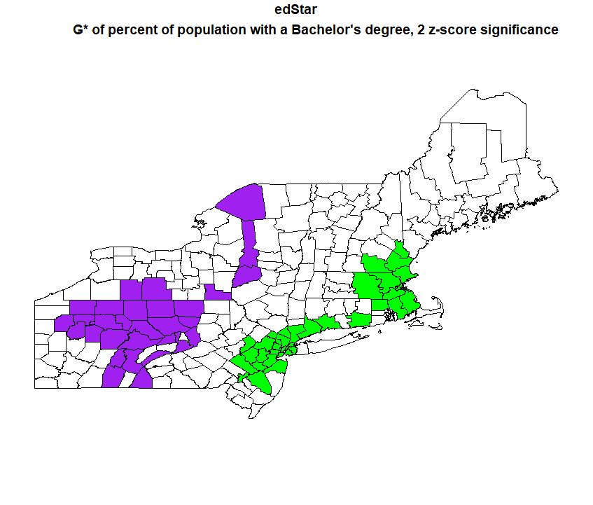
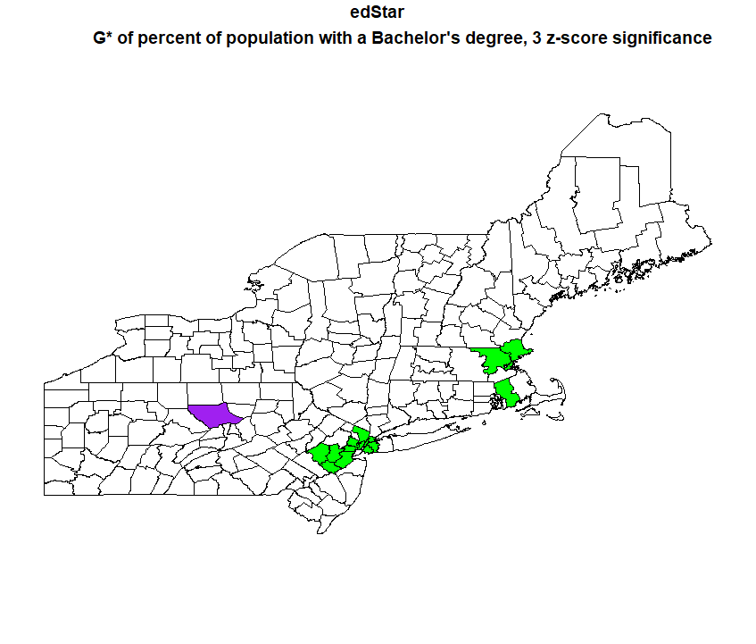

# OpenSource GIScience Final Project
### Various Function of the spdep spatial statistics package in RStudio

My goal in this project was to teach myself how to do some spatial statistical analysis in RStudio, as well as to familiarize myself with R and how it works for any future work I do in it. Although we used R in the twitter data labs, this was the first time I was writing my own R code from scratch. Specifically, my objective was to create and map the G* value of the ratio of seasonal homes to people by county, run a linear regression on the ratio of seasonal homes, and find the global Moran's I of the regression residuals, all using spdep (I did this work using version 1.1.3). I chose these three tests because they are three different ways of analyzing data for trends. The G* looks at spatial clustering of just one value, a linear regression only looks at how different variables are related to the outcome and does not include spatial data, the global Moran's I for regression residuals uses spatial data, along with multiple variables because it is based on regression residuals. The goal of the actual research is to investigate what influences where seasonal homes are located in the northeastern United States. I limited the scope to the northeastern United States because I hypothesized that skiing would be a big influencer of where vacation homes are in the north, but not in the south. 

All the data used for the lab came from the [United States Census Bureau](https://www.census.gov/data.html), and I downloaded it in RStudio using a census API and the tidycensus package. Because I chose to pull in data from the Census Bureau, my first step to learning how to use spdep was learning how to use tidycensus. It was also my first time writing my own code in R, but fortunately it functions a lot like javascript (which I have experience using in google earth engine) so it wasn't too difficult to pick up. It also took a bit of time to figure out how to use tidycensus. I had access to the creators help document, but even then I had to work around making the code actually work. I wanted to do the analysis at the county subdivision (town/city) level, but I couldnt successfully make the code work when I searched for "county subdivision" instead of "county" as my geography. I ended doing the analysis at the county level, although later I discovered that I could call the data one state at a time at the county subdivision level, and it would be possible to do that then aggregate it all into one table.

I've provided the [R script I used in this investigation](spdepcodeComplete.r) 

A brief walkthrough of my project is as follows:

Step 1: Load tidycensus, RColorBrewer, dplyr, and spdep libraries

Step 2: Download two data columns from the 2010 census; number of urban households and number of rural households by county (which comes with geometry and identifying information). Only download data from Massachusetts, Connecticut, Rhode Island, Maine, New Hampshire, Vermont, New York, New Jersey, and Pennsylvania.

Step 3: using the same methods as in step 3, download four data columns from the 2017 American Community Survey, by county; population, number of people with a bachelor's degree, median annual income, and number of seasonally occupied homes.

Step 4: Join the two tables together.

Step 5: Create three new columns in the table; Ratio of seasonal homes to population (seasonal homes/population), percent of rural households (rural households/(ruralhouseholds+urban households)), and percent of people with a Bachelor's Degree (bachelors degrees/population).

Step 6: Run a linear regression, with seasonal population as the dependent variable and median household income, percent rural, and percent with a bachelor's degree as independent variables. The results of my regression are below.

Step 7: Create a neighbors list from the county polygons. I chose to use queen contiguity because of how permeable county borders are.

Step 8: Create spatial weights based on that neighbors list

Step 9: Run a Global Moran's I Test for Residual Spatial Autocorrellation using the regression and the spatial weights. Results below

Step 10: Run a local G* analysis on the ratio of season housing to people

Step 11: Map that G* analysis. I mapped the G* analysis of at both a 1 z-score significance level and a 2 z-score significance level.

My results are generally in line with what I expected. For the G* maps, there are hotspots of season housing in the Catskills, the Adirondacks, and lakes/white mountains region of New Hampshire and western Maine. The coldspots are centered around large cities like Boston, New York, Philadelphia, and Pittsburgh. 

The linear regression indicated all three factor are signigicant to predicting where seasonal housing is, although rural percentage and percent of population with a bachelor's degree predicted it better than median income. I had expected median income to actually be a better predictor than bachelor's degrees, so I decided to do another G* analysis to see where the hot and cold spots of percent of the population with a bachelor's degree were.

The hotspots of percent of the population with a bachelor's degree line up pretty well with the coldspots of the season housing, and vice versa, so it makes sense visually that there would be a strong correllation. Its also interesting to not that the hotspots of the percent with a bachelor's degree are more significant than the hotspots of the season housing, as I mapped percent with a bachelor's degree at a significance of 2 and 3 z-scores, whereas seasonal housing I could only go up to 2 z-scores. 

The Moran's I test found that there is spatial autocorrellation among the regression residuals, with a p value of 0.01, and that it is a positive correlation. 

The research I conducted is entirely OpenSource, as it only uses software that can be freely downloaded off the internet, and census data which can also be downloaded for free, even without the API, which can be acquired through a free and easy process. The data is both replicable, with the R script I have provided, and reproducible. If you want to do a similar analysis of different census data, or in a different region of the United States, it only requires minor changes to the attributes that are pulled from the census, and the variable names in functions. Even if you do the analysis using a different dataset, you would need to upload the data in a different manner but the functions and visualization should work the same.

One issue with the results of my dataset is that I did not take into account error, and while the census data (urban/rural) households has minimal error because it is hypothetically a full count of the United States, the American Community Survey data is based on sample survey's, and so there is a margin of error. That margin of error is provided along with the estimates in the dataset I downloaded using the census API, but working that into my calculations was beyond the scope of my research, as I am still quite new to using R. Running a Monte Carlo simulation would be one good way to try to account for error.

Attached here is [a csv file of my data](spdepData.csv)

------------------------------------------------------------------------------------------------------------------------------
Tutorials used:

https://rstudio-pubs-static.s3.amazonaws.com/126356_ef7961b3ac164cd080982bc743b9777e.html
http://labs.bio.unc.edu/buckley/documents/anselinintrospatregres.pdf

[Return to Homepage](index.md)
